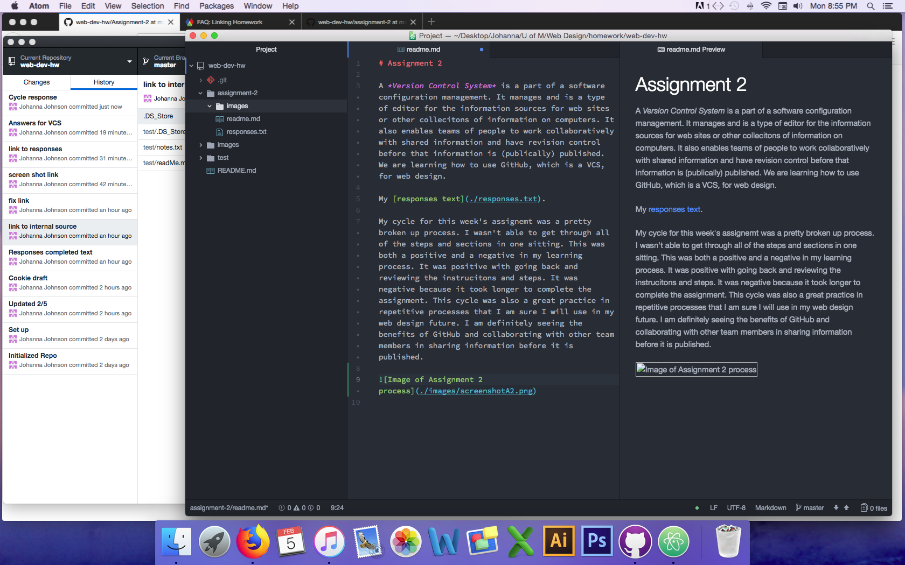

<!DOCTYPE html>

# Assignment 2

A *Version Control System* is a part of a software configuration management.
It manages and is a type of editor for the information sources for web sites
or other collecitons of information on computers. It also enables teams of
people to work collaboratively with shared information and have revision control
before that information is (publically) published. We are learning how to use
GitHub, which is a VCS, for web design.

My [responses text](./responses.txt).

---

My cycle for this week's assignemt was a pretty broken up process. I wasn't able
 to get through all of the steps and sections in one sitting. This was both a
 positive and a negative in my learning process. It was positive with going back
  and reviewing the instrucitons and steps. It was negative because it took
  longer to complete the assignment. This cycle was also a great practice in
  repetitive processes that I am sure I will use in my web design future.
  I am definitely seeing the benefits of GitHub and collaborating with other
  team members in sharing information before it is published.

