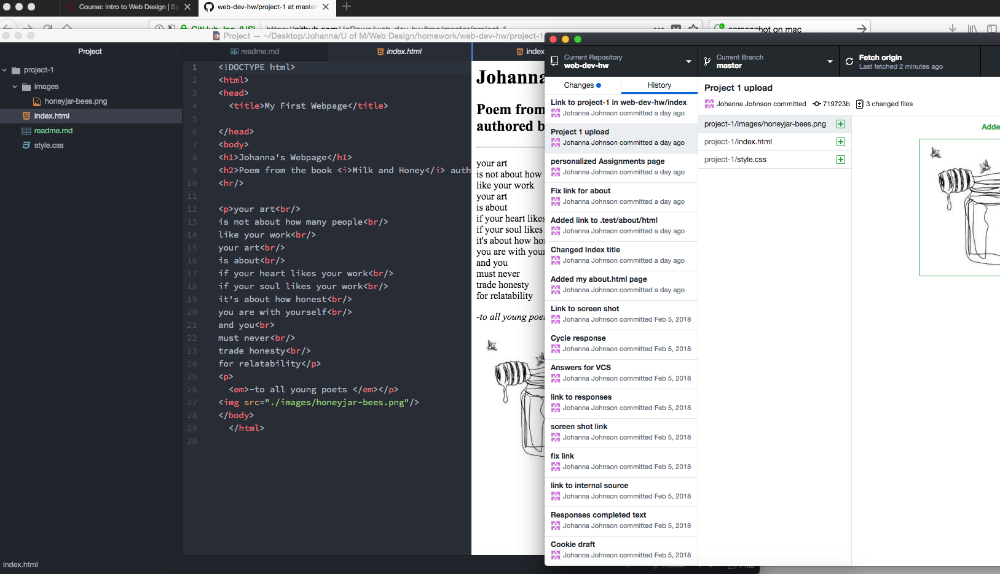

<h1>Part 2: Technical Report </h1>

The browsers I use to surf the web are Firefox and Safari, but mostly Firefox. On my smartphone, I use the factory pre-set browser of Google Chrome. 
A browser's main function is to show a user to webpage requested. It is a kind of translator between code on the web and a server and displaying that information retreived in the browser's window. A browser has the ability to interpret and display HTML and CSS files requested by a user typing in a URL or DNS. 

My experience with the Wayback Machine was minimal. I went to the National Geographic website from 1998. I found it surprising that the website was only update twice during the year. Once in January and then again in late December. It looked like a lot of text that was the same size and typeface. There were some nice images, but the page didn't have a clearn heirarchy in what the website visitor was supposed to be looking at or where to navigate. Compared to today, it seems very childish and unpolished. It has changed to today by having a much stronger direction. It has a clear direction for visitors and has enough variety in type sizes that you can tell what is important. It also is more colorful and has a unity for the recognizable color and font theme.  

 My work cyle for this assignment was a bit more fluid, but I also had some snags in my productivity. I kept having a problem with Atom crashing on me when I would try to add a link while in the HTML preview toggle mode. I was able to contact our instructor, Justine Evans, and figure out what I could do to change this interruption. It was extremely helpful and I know that adding outside links is possible but to preview them by saving them and then opening them up separately in a brower window. It worked! I feel less frustrated than last week.

Here is a screenshot of my workspace during my development cycle.

