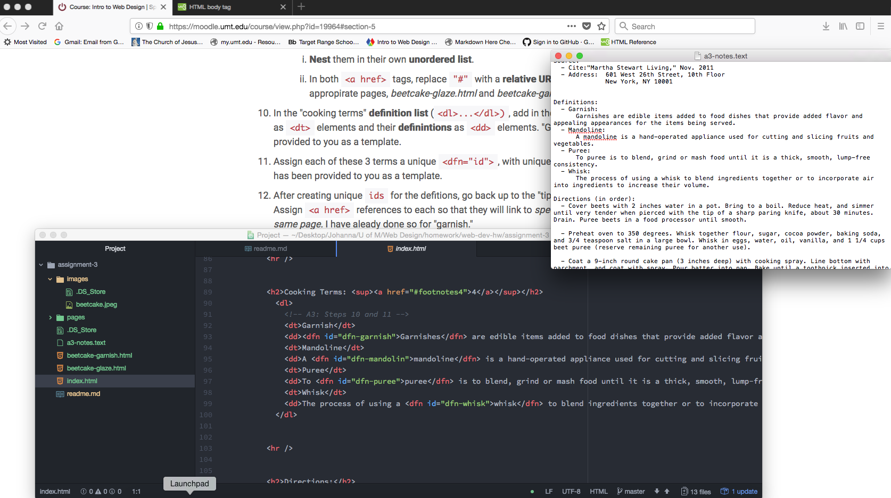

<!DOCTYPE md>
<!--This section is to remind you to make notes for your work project of creating an interactive neighborhood map with links embedded into the image. It will be awesome! DON'T GIVE UP-->
<head>
<meta charset="utf-8">
<meta name="author" content="Johanna Johnson">
<meta name="viewport" content="width=device-width, initial-scale-1.0">
<title>Technical Report</title>

</head>

<body>
  <h1>Technical Report</h1>
  <h3>Johanna Johnson</h3>
    
An html page must have one head and body element. One of each is all that is needed and necessary for a funtional webpage.
    

    
The diffrence between structural and semantic markups are their purpose. Structural markup is like directions and organization. Some examples of structural markup are:
      <ul>
        <li>paragraphs</li>
        <li>headings</li>
        <li>block quotes</li>
        <li>lists</li>
        </ul>
    Semantic markup is for formatting and more specific direction for a certain set of code. Such as:
      <ul>
        <li>making text <b>bold</b>, <i>italic</i>, etc.</li>
        <li>links to other pages</li>
        <li>forms for information</li>
        <li>definitions</li>
    

    
My work for this cylce was slow-coming. I got hung up in trying to write the realitve url for the first image. I kept trying different addresses, files and even the actual url to show only the image. I didn't realize until I moved on to the other steps that the link was meant to direct the viewer to the footnote, and not bring up a new window to view a picture that was already being displayed. Again, I was frustrated with trying to understand what was being asked of me and it was simpler than I was making it. As I got further down the steps for the index.html page, I discovered that I really needed to slow down when I read the instructions. It was very clear of what lines to go to, what markup was being requested and what examples were being given. I think I start the steps blindly following the words and then by the end of the assignment I understand what the end result is supposed to be and seeing that represented in the code created. I really liked the examples given with the links with the definitions. I thought that was a very complex compilation of code and it was helpful to have a correct example instead of just asking us to create the links and markups from scratch.
    

    
 Here is a screenshot of my workspace during my development cycle for Assignment 3. 
    
    

</body>

</html>
