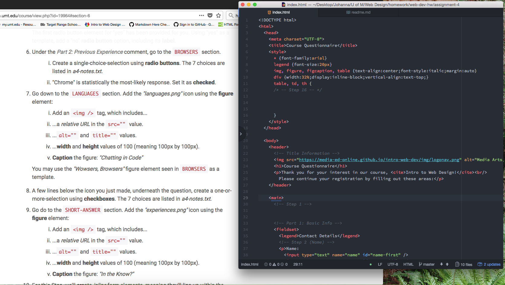

<!DOCTYPE md>
 <head>
  <meta charset="UTF-8">
  <meta name="Report: Assignment 4" content="Head Elements in HTML">
  <meta name="author" content="Johanna Johnson">
  <meta name="viewport" content="width=device-width, initial-scale=1.0">
  <title>Repo Assignment 4</title>
</head>

<body>
  <h1>Assignment 4</h1>

  <h3>Johanna Johnson</h3>

"Alt text" is text that can be put into the same line of code for an image.  We use it as a kind of backup if an image doesn't render on a website. It is important to also use this for those who have visual impairments and have a diffucult time seeing what that image is. The 'alt text' gives them a simple description of what is being displayed.

 Some forms that I have come across while browsing the web are mostly sign-in with a password and search text boxes. These serve a purpose with user data, with certain information saved about my account, documents, history or preferences. Having forms allows users to have a web experience that is catered to them and personalized, making it more enjoyable. There is also the element of familiarity and ease of use when someone can find and access information quickly.

My work cycle for this assignment was a bit easier. I tried taking more notes during the modules and steps to hopefully help me memorize some of the new information. I think it helped me understand and break-down the complex coding language we are learning. I think I may have taken too much time or tried to make them too detailed because I didn't leave myself enough time to complete the practicum assignment.

Here is a screen shot of my workspace during my development cycle. 
  

</body>
