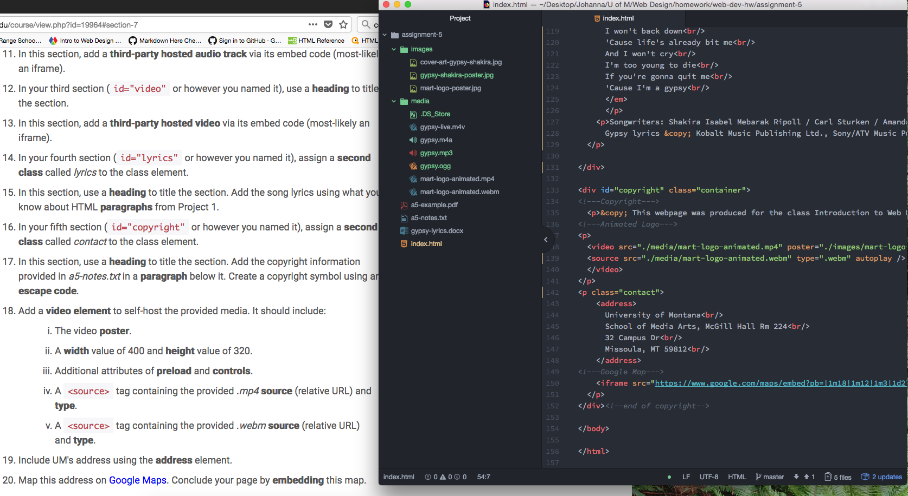

<DOCTYPE html>
<html lang="en">

<head>
  <meta charset="utf-8">
  <meta name="description" content="Assignment 5 Repo">
  <meta name="author" content="Johanna Johnson">
  <meta name="robots" content="no snippet">
  <meta name="viewport" content="width=device-width, initial-scale=1.0">

</head>

<body>
  <h1>Technical Report</h1>
  <h3>Johanna Johnson</h3>
  <h2>Assignment 5</h2>

  

    
The differences: 
      <ul>
      <strong>div=dividers</strong> 
        <li>block level element</li>
        <li>groups other elements together</li> 
        <li>provides structure without implying style or content</li> 
      <strong>class=unique name</strong> 
        <li>identifier and selector for elements</li> 
        <li>groups similar types of elements together by using the same unique name</li> 
      <strong>id=identifier</strong> 
        <li>global attribute (can be used on any element) to identify an element</li> 
        <li>allows a specific styling for any block element</li> 
      <strong>span=inline element 'specifier'</strong> 
        <li>an identifier for inline elements</li> 
        <li>adds organization</li> 
        <li>optional extra styling</li> 
      </ul>
    

    
One may consider third-party over self-hosted media because the format of the media can be read by more browsers. Certain browsers can understand or are able to read specific types of files. If you self-host you have to convert and provide code for the different browsers visitors may be using to your website. It makes the process of including media much easier if you use third-party hosted media. Another reason could be the avoidance of not giving proper credit or sources in dealing with artist usage and sharing allowances. Meaning, you could unintentionally be sharing priviledged or licensed media that is not supposed to be accessible without paying for it.
    

    
My work cycle for this assignment was not smooth or pleasing. There was a ton of definitions and longer sequences to learn how to piece together properly. It only got harder trying to figure out how to put the information into practice with the assignment. I'm also now afraid I am going to be fined or charged with pirateing music/vido/cover art and plagarism. I was happy when I finally got my source codes to actually work on safari, firefox and google chrome. It was an uncomfortable learning curve and I'm not happy with how basic and ugly everything still looks.
    

    
Screenshot of my workspace during my development cyle. 
      
    

  

</body>

</html>
