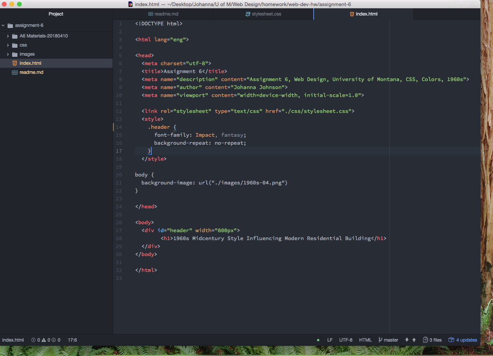

<!DOCTYPE md>

<h1>Technical Report</h1>
<h3>Assignment 6: Color and CSS</h3>

Question 1

Question 2

My work cycle for this assignment is that I understand the concept and am completely unable to put it into practice. Too much for me to understand in a short period of time. The book and the instructions online are contrary to each other. SUPER CONFUSED!

Here is a screenshot of the beginning of my development cycle. 

