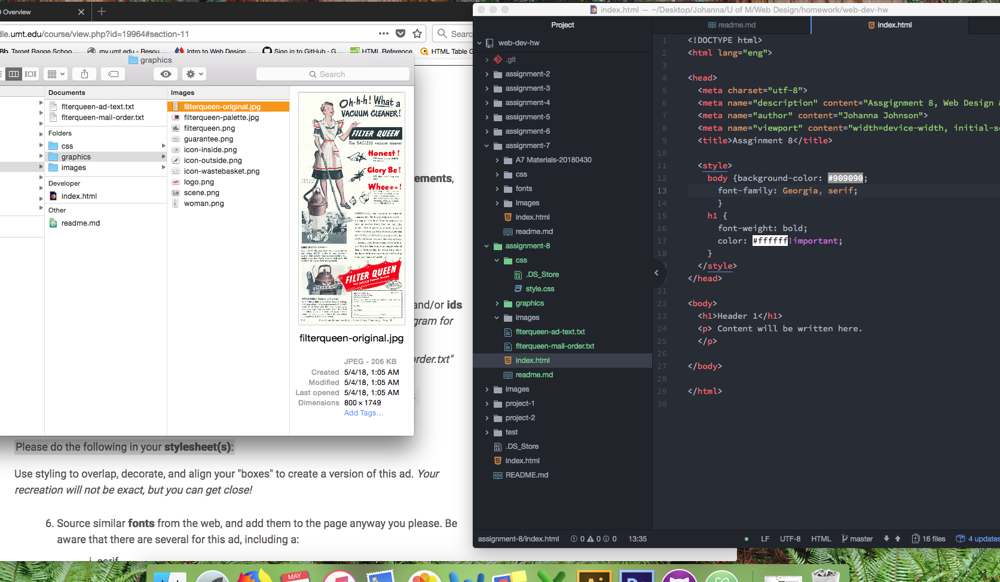

<!DOCTYPE md>

<h1>Assignment 8: Basic Layout</h1>

<h3>Johanna Johnson</h3>

 The difference between <i>padding</i>, <i>margin</i>, and <i>borders</i> are...
 

 
The hardest task for me to accomplish within this assignment was...
 

 
My work cycle for this assignment went...
 

 
Here is a snapshot of my work cycle. 
 
