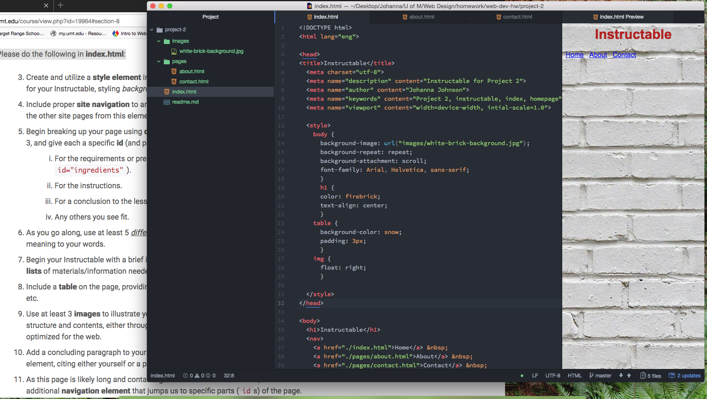

<!DOCTYPE md>

<h1>Technical Report</h1>
<h3>Project 2: Instructable</h3>

 My experience learning HTML was all new, very interesting, definitely challenging and I feel proud of what I have learned so far. The information was a lot to take in and process and then to implement was stressful. I understood what was being asked of me, but I found out you had to go back and forth to troubleshoot why something didn't work, like a link or image. I think it is worth the challenge to learn HTML because it helps you navigate and understand what it takes to really put information out onto the internet. I know that I don't completely understand forms and inputs yet and I have a hard time understanding where the information goes and how it gets used.

I am excited to learn CSS because I feel like that is what draws and keeps visitors to websites is the aesthetics and design aspect. This doesn't mean that the proper structure and functionality doesn't need to be there as well, but it shouldn't be too crammed full of images and forms and tables. I really don't like coding tables. I am anxious to learn to control and specify the style of a website. That is more of what I am drawn to as a designer and artist.

My work cycle for this assignment was fast at the beginning because there wasn't a lot of new code and language to learn. After I got my basic structure in, adding all of the inputs, forms, and such was really hard for me. I don't feel confident in those aspects yet. I am also unsure on what is the best size ratio for images and other graphics. I had way better plans and intentions with this project with my own photos and more detailed instructions planned out, but I got frustrated a lot costing me time and losing my interest in what I chose to display.

Here is a screenshot of the beginning of my development cycle. 

